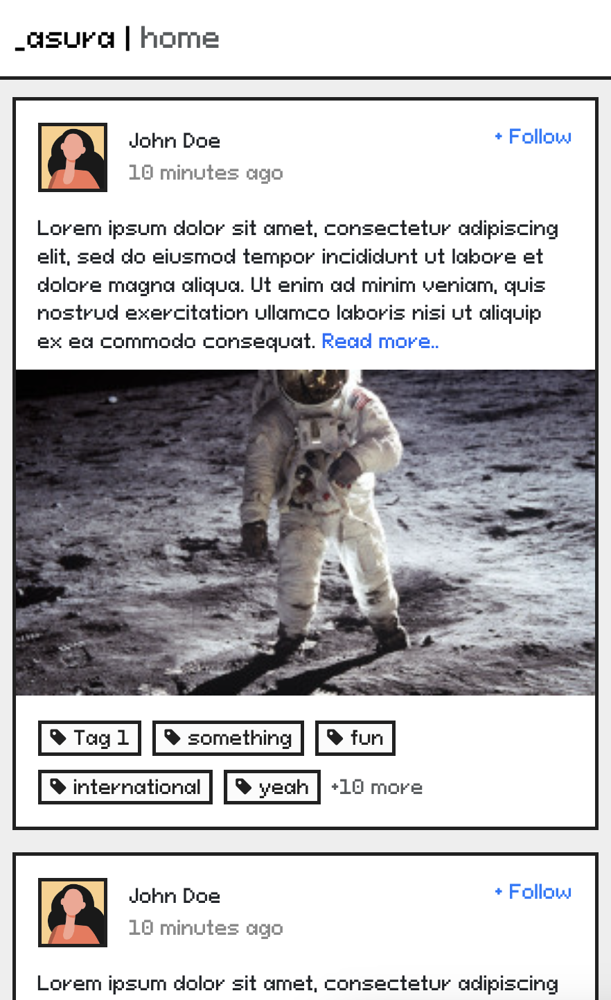

# Asura: minimalist social app.

## A minimalist news feed app built with Angular.



## Ingredients
- Angular 18.0
- Bootstrap 5.3
- Bootstrap icons

## Build the project

Just the two commands `npm i` and `npm start`.

## License
```
Licensed under the Apache License, Version 2.0 (the "License");
you may not use this file except in compliance with the License.
You may obtain a copy of the License at

	http://www.apache.org/licenses/LICENSE-2.0

Unless required by applicable law or agreed to in writing, software
distributed under the License is distributed on an "AS IS" BASIS,
WITHOUT WARRANTIES OR CONDITIONS OF ANY KIND, either express or implied.
See the License for the specific language governing permissions and
limitations under the License blah blah blah.
```