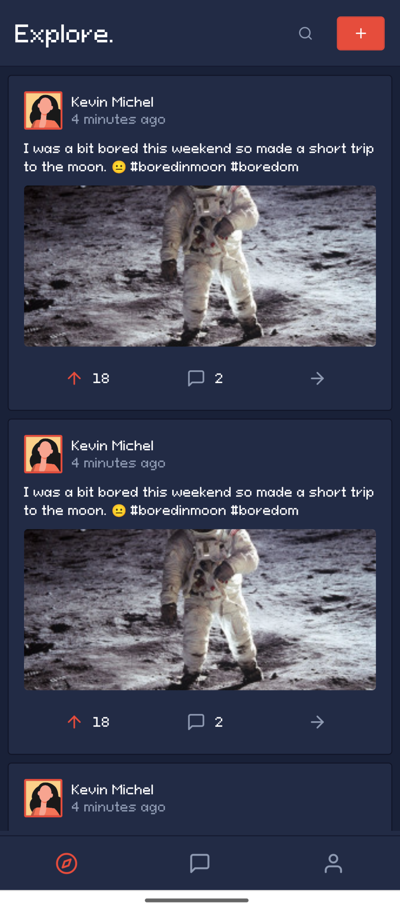
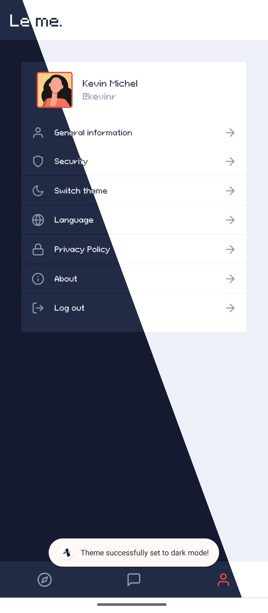
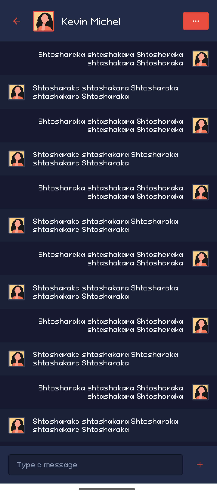
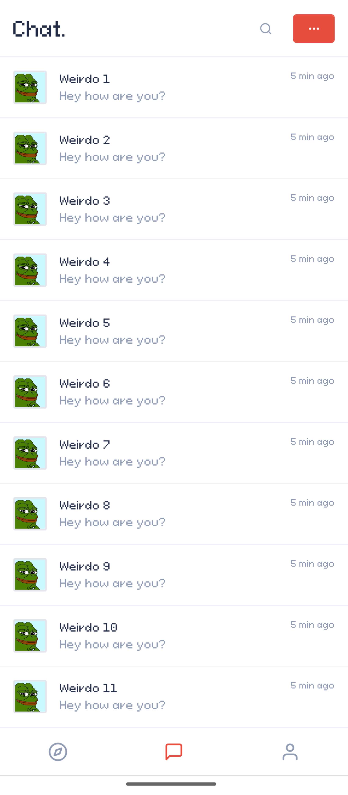

# Asura: another social app
Here's another social app. Yay.. **exactly** what we needed.

Home | Profile
--- | ---
 | 
Thread | Chat
 | 

## 🍔 Ingredients
- React Native 0.71.7
- [UI Kitten 5.3](https://akveo.github.io/react-native-ui-kitten/)
- Expo CLI
- Updog

## 🏈 Build the damn project
### Install the dependencies
Navigate to the project root folder, then run the following command.
```
npm install
```

### Run the project
Run the following command depending on your preferred platform.
```
npm run android
```
```
npm run ios
```

## 📄 What's on the menu?
### Pages
- [X] Home timeline
- [X] Conversation list
- [X] Individual conversation
- [X] Profile
- [X] Login

### Features
- [X] Dark theme
- [ ] Pagination
- [ ] Like / comment count 

## License
```
Licensed under the Apache License, Version 2.0 (the "License");
you may not use this file except in compliance with the License.
You may obtain a copy of the License at

	http://www.apache.org/licenses/LICENSE-2.0

Unless required by applicable law or agreed to in writing, software
distributed under the License is distributed on an "AS IS" BASIS,
WITHOUT WARRANTIES OR CONDITIONS OF ANY KIND, either express or implied.
See the License for the specific language governing permissions and
limitations under the License.
```